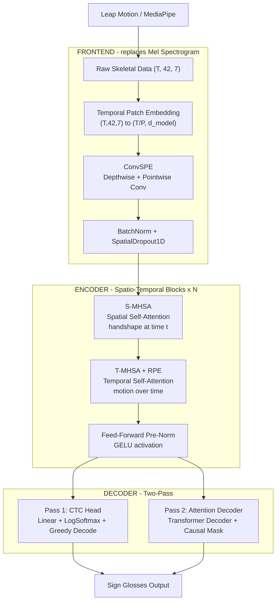

<p align="center">
  <h1 align="center">WhisperSign</h1>
  <p align="center">
    <strong>Modified OpenAI Whisper for Real-Time Sign Language Recognition</strong><br>
    <em>From Audio Spectrograms to 3D Skeletal Data</em>
  </p>
  <p align="center">
    
    
    
    
    
  </p>
</p>

---

## Overview

**WhisperSign** reimagines OpenAI's Whisper architecture for sign language recognition. Instead of processing audio via Log-Mel Spectrograms, it accepts **3D skeletal hand data** `(T x 42 x 7)` from Leap Motion or MediaPipe — 42 hand joints (21 per hand) with 7 features each (x, y, z, velocity_x, velocity_y, velocity_z, confidence).

The model outputs **sign glosses** — semantic labels for individual signs — enabling real-time translation of hand gestures into text.

### Sign Language Standard

WhisperSign currently targets **Vietnamese Sign Language (VSL)** — _Ngon ngu ky hieu Viet Nam_. VSL is the primary sign language used by the deaf community in Vietnam, with its own grammar and phonology distinct from spoken Vietnamese.

The model recognizes **isolated sign glosses** (individual sign labels such as "xin_chao", "cam_on", "ban") rather than continuous signed sentences.

**Supported Vietnamese Sign Language Datasets:**

| Dataset | Source | Format | Size |
|---------|--------|--------|------|
| VSL-Vietnamese Sign Languages | [Kaggle](https://www.kaggle.com/datasets/phamminhhoang/vsl-vietnamese-sign-languages) | Videos + label.csv | Varied |
| VOYA_VSL | [HuggingFace](https://huggingface.co/datasets/VOYA/VOYA_VSL) | Pre-extracted MediaPipe keypoints (.npz) | ~161 samples |
| Multi-VSL | [CVPR Paper](https://openaccess.thecvf.com/) | 1000 glosses, 84k+ videos, 30 signers | Large-scale |

> **Note:** The architecture is language-agnostic. You can train on any sign language dataset by providing the appropriate `label_map.json`. The input format (skeletal hand keypoints) is universal across sign languages.

### Why Modify Whisper?

| Challenge | Whisper's Strength | Our Adaptation |
|-----------|-------------------|----------------|
| Temporal sequence modeling | Proven on variable-length audio | Applied to variable-length gesture sequences |
| Noisy real-world input | Robust to audio noise | Robust to skeletal tracking noise |
| Multi-scale pattern detection | Phoneme to word to sentence | Finger config to hand shape to sign phrase |
| Real-time streaming | Efficient attention mechanism | Sliding window inference for live translation |

---

## Architecture



### Key Architecture Decisions

| Component | Design Choice | Rationale |
|-----------|--------------|-----------|
| **Frontend** | Temporal Patch Embedding (not Conv2D) | Skeletal data is structured (joints x features), not pixels. Patches group P consecutive frames. |
| **Positional Encoding** | ConvSPE (learned, convolutional) | Hand skeleton has fixed topology. Learned spatial relationships outperform sinusoidal PE. |
| **Encoder Attention** | Dual S-MHSA + T-MHSA (not unified) | Separating spatial and temporal attention allows the model to independently reason about handshape vs motion. |
| **Temporal Attention** | Relative Positional Encoding (RPE) | Sign dynamics depend on relative timing between movements, not absolute position. |
| **Decoder** | CTC + Attention (two-pass) | CTC provides fast monotonic alignment. Attention rescoring improves accuracy. Hybrid loss: `L = a*CTC + (1-a)*Attention`. |
| **Normalization** | Pre-Norm (LayerNorm before attention) | More stable training with deeper networks, better gradient flow. |

---

## Features

### Data Pipeline
- **Spline Interpolation Resampling** -- Converts variable frame rates to fixed 60 Hz using cubic spline interpolation
- **Hand-Centric Spatial Normalization** -- Translates coordinates so palm joint is at origin (left and right hands independently)
- **Scale Normalization** -- Normalizes by metacarpal bone length for hand-size invariance
- **Feature Scaling** -- StandardScaler or MinMaxScaler applied across the dataset
- **Gesture Masking Augmentation** -- Randomly masks joints or temporal segments (like SpecAugment for audio)
- **Temporal Jitter** -- Random frame shifting for temporal robustness
- **Noise Injection** -- Gaussian noise to simulate sensor inaccuracy

### Model
- **4.2M parameters** (base config, d_model=512) -- lightweight enough for real-time inference
- **Configurable depth** -- Scale from tiny (d_model=128) to large (d_model=768)
- **Freeze/Unfreeze API** -- Selective component training for transfer learning
- **Checkpoint save/load** -- Full state persistence including epoch, loss, and config

### Training
- **3-Stage Progressive Training**
  - Stage 1: Frontend warm-up (encoder + decoder frozen)
  - Stage 2: Joint training with hybrid CTC-Attention loss
  - Stage 3: Real-time optimization with sliding window augmentation
- **Hybrid CTC-Attention Loss** with configurable weight
- **Cosine Warmup Scheduler** -- Linear warmup followed by cosine annealing
- **Gradient Clipping** -- Prevents training instability
- **TensorBoard Logging** -- Real-time loss and metric visualization

### Inference
- **Sliding Window Inference** -- Process continuous streams in real-time with configurable overlap
- **Moving Average Smoothing** -- Reduces sensor noise in live data
- **MediaPipe Integration** -- Extract hand keypoints directly from video

---

## Technical Specifications

### Model Configurations

| Config | d_model | Layers | Heads | Params | GPU Memory | Use Case |
|--------|---------|--------|-------|--------|------------|----------|
| Tiny | 128 | 2 | 4 | ~1.1M | ~2 GB | Prototyping, edge devices |
| Base | 256 | 4 | 4 | ~4.2M | ~4 GB | Balanced performance |
| **Default** | **512** | **6** | **8** | **~18M** | **~8 GB** | **Recommended** |
| Large | 768 | 8 | 12 | ~45M | ~16 GB | Maximum accuracy |

### Input Format

| Feature | Index | Description |
|---------|-------|-------------|
| x, y, z | 0-2 | 3D joint coordinates (meters) |
| vx, vy, vz | 3-5 | Joint velocities (m/s) |
| confidence | 6 | Tracking confidence [0, 1] |

**Joint Layout:** 21 joints per hand x 2 hands = 42 joints total (following MediaPipe hand landmark convention)

### Training Pipeline


---

## Verification

The model has been verified with **112 tests** across two test suites:

### Structural Tests (68/68 passed)
- Tensor shape propagation through all components
- Gradient flow from loss to every trainable parameter
- Hybrid loss formula correctness
- Checkpoint save/load round-trip (weights identical)
- Numerical stability with extreme inputs (x100, x0.001)
- Edge cases: batch=1, minimum sequence length, all-zero input

### Functional Tests (44/44 passed)
- **CTC Decoding**: Blank removal, deduplication, alternating patterns all correct
- **Causal Mask**: Verified no future information leakage in attention decoder
- **Encoder Masking**: Padded positions properly ignored (cosine similarity = 0.975)
- **RPE**: Shift-invariant, distance-differentiating relative position encoding
- **Memorization**: Loss dropped from 3.678 to 0.006 in 80 steps, 4/4 samples decoded correctly
- **Gradient Health**: No vanishing/exploding, frontend-to-encoder ratio = 1.3x
- **End-to-End**: Full pipeline from numpy input to decoded sign glosses

Run the tests:
```bash
python scripts/smoke_test.py
python scripts/deep_test.py
python scripts/functional_test.py
```

---

## Getting Started

### Installation

```bash
git clone https://github.com/minhduc110207/Whisper_modification.git
cd Whisper_modification
pip install -r requirements.txt
```

### Quick Verification

```bash
python scripts/smoke_test.py
```

### Data Preparation (Vietnamese Sign Language)

```bash
# Option 1: From Kaggle VSL dataset (videos)
python scripts/prepare_vsl_data.py --source kaggle --data_dir data/raw/kaggle_vsl

# Option 2: From HuggingFace VOYA_VSL (pre-extracted keypoints)
python scripts/prepare_vsl_data.py --source huggingface

# Option 3: From your own video collection
python scripts/prepare_vsl_data.py --source video --data_dir path/to/videos --label_csv labels.csv
```

### Training

```bash
python scripts/train.py --config configs/config.yaml --data_dir data/processed

python scripts/train.py --config configs/config.yaml --stage 1
python scripts/train.py --config configs/config.yaml --stage 2 --resume checkpoints/best_stage1.pt
python scripts/train.py --config configs/config.yaml --stage 3 --resume checkpoints/best_stage2.pt

python scripts/train.py --config configs/config.yaml --device cuda
```

For the complete training process, see [TRAINING.md](TRAINING.md).

### Inference

```python
import torch
from src.model.whisper_sign import WhisperSignModel

model, _ = WhisperSignModel.load_checkpoint("checkpoints/final_model.pt")
model.eval()

data = torch.randn(1, 120, 42, 7)
lengths = torch.tensor([120])
predictions = model.decode(data, lengths)
print(predictions[0])
```

### Real-Time Streaming

```python
from src.utils.sliding_window import SlidingWindowInference
from src.utils.smoothing import MovingAverageSmoothing

model, _ = WhisperSignModel.load_checkpoint("checkpoints/final_model.pt")
smoother = MovingAverageSmoothing(window_size=5)
slider = SlidingWindowInference(model, window_duration=1.0, overlap=0.5)

stream_data = get_leap_motion_stream()
smoothed = smoother.smooth(stream_data)
predictions = slider(smoothed)
```

### Training on Google Colab

See [COLAB_TRAINING_GUIDE.md](COLAB_TRAINING_GUIDE.md) for a step-by-step guide.

---

## Project Structure

```
Whisper_modification/
├── configs/
│   └── config.yaml
├── src/
│   ├── data/
│   │   ├── preprocessing.py
│   │   ├── normalization.py
│   │   ├── augmentation.py
│   │   └── dataset.py
│   ├── model/
│   │   ├── frontend.py
│   │   ├── positional.py
│   │   ├── encoder.py
│   │   ├── decoder.py
│   │   └── whisper_sign.py
│   ├── training/
│   │   ├── losses.py
│   │   ├── scheduler.py
│   │   └── trainer.py
│   └── utils/
│       ├── sliding_window.py
│       ├── smoothing.py
│       └── mediapipe_extract.py
├── scripts/
│   ├── train.py
│   ├── smoke_test.py
│   ├── deep_test.py
│   ├── functional_test.py
│   └── prepare_vsl_data.py
├── TRAINING.md
├── COLAB_TRAINING_GUIDE.md
├── requirements.txt
└── README.md
```

---

## Configuration

All hyperparameters are managed through `configs/config.yaml`:

```yaml
model:
  frontend:
    num_joints: 42
    num_features: 7
    patch_size: 4
    d_model: 512
  encoder:
    num_heads: 8
    num_layers: 6
    d_ff: 2048
  decoder:
    vocab_size: 1296
    blank_id: 0

training:
  stage1: { epochs: 30,  lr: 1e-3, freeze_encoder: true }
  stage2: { epochs: 100, lr: 5e-5, alpha: 0.3 }
  stage3: { epochs: 30,  lr: 1e-5, alpha: 0.3 }
```

---

## Data Format

### Input Data Structure

```
data/processed/
├── train/
│   ├── features/
│   └── labels/
├── val/
│   ├── features/
│   └── labels/
└── test/
    ├── features/
    └── labels/
```

### Supported Data Sources

| Source | Joints | FPS | Notes |
|--------|--------|-----|-------|
| Leap Motion | 42 (2x21) | 120 Hz | Highest accuracy, requires hardware |
| MediaPipe | 42 (2x21) | 30-60 Hz | Camera-based, use `mediapipe_extract.py` |
| Custom | Any | Any | Resample to 60 Hz using `preprocessing.py` |

---

## References

- [Whisper: Robust Speech Recognition via Large-Scale Weak Supervision](https://arxiv.org/abs/2212.04356) -- Radford et al., 2022
- [CTC: Connectionist Temporal Classification](https://www.cs.toronto.edu/~graves/icml_2006.pdf) -- Graves et al., 2006
- [MediaPipe Hands](https://google.github.io/mediapipe/solutions/hands.html) -- Google, 2020

---

## License

This project is licensed under the MIT License.
